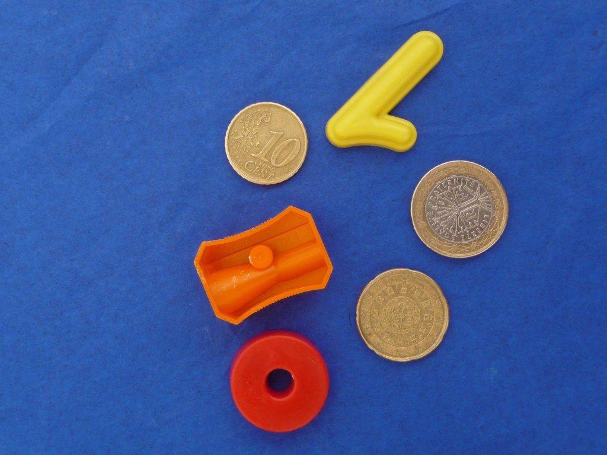
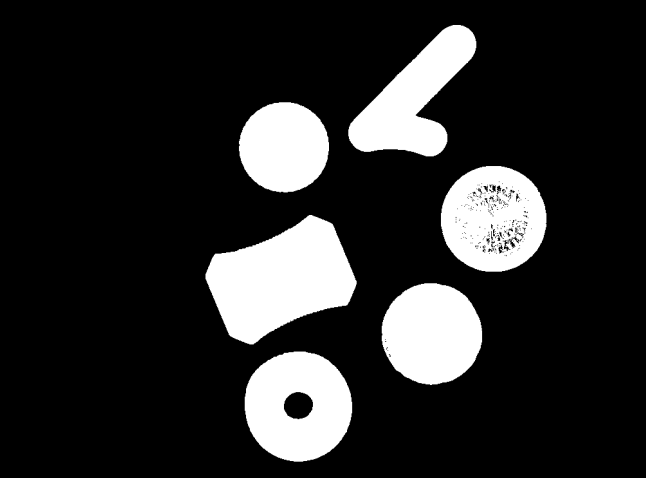
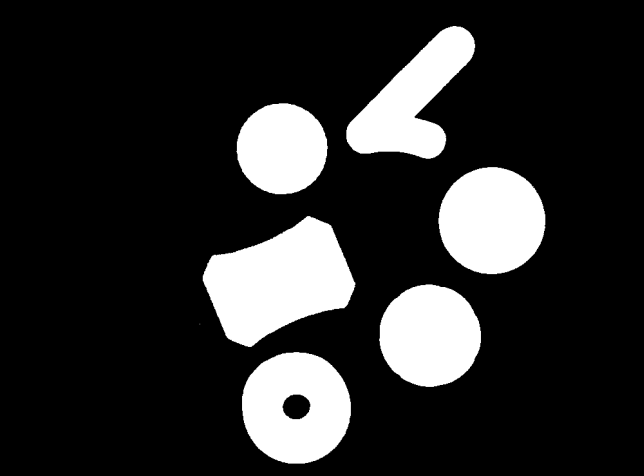
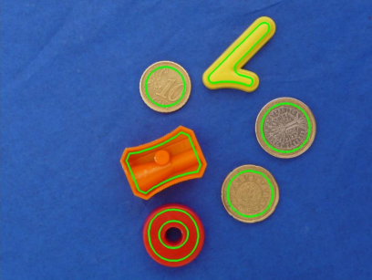
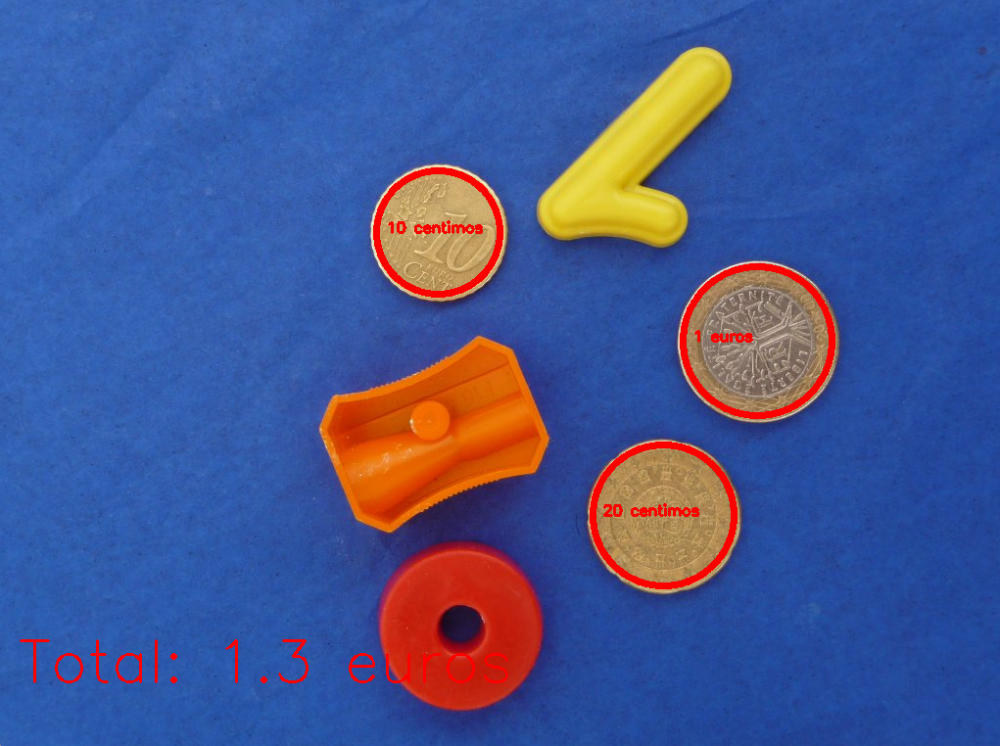
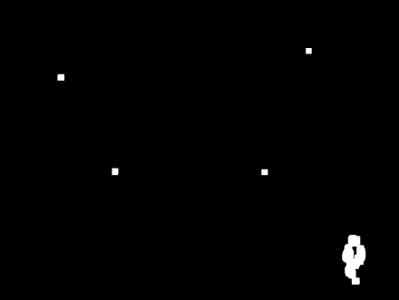
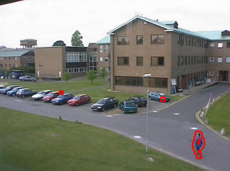
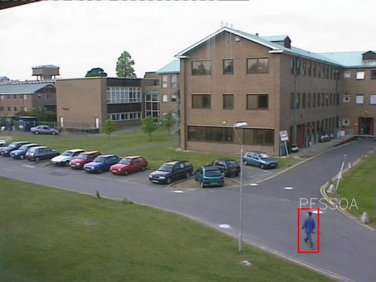
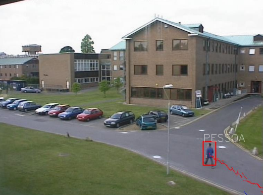

# Object detection in video and images
## Coin detection in images
1. The objective is to count the total amount of money in an image.
2. To achieve this, binarization is applied to the image.
3. Next, some morphological operations are applied to improve the quality of the results.
4. Then, the extraction of connected components is performed.
5. Based on the shape, exclude objects that are not coins.
6. Afterward, a classifier is applied to determine the value of each coin based on its size.
7. Finally, the total amount of money is calculated.
<table>
  <tr>
    <td></td>
    <td></td>
    <td></td>
</tr>
  <tr>
    <td style="text-align: center;"><em>1. Input image</em></td>
    <td style="text-align: center;"><em>2. Binary image</em></td>
    <td style="text-align: center;"><em>3. Better image</em></td>
  </tr>
</table>

<table>
  <tr>
    <td></td>
    <td></td>
    <td></td>
</tr>
  <tr>
    <td style="text-align: center;"><em>4. Image with countours</em></td>
    <td style="text-align: center;"><em>5. Selected countours</em></td>
    <td style="text-align: center;"><em>7. Final result</em></td>
  </tr>
</table>

## Object detection in video
1. The objective is to have a program that checks which object is in a video which can be a "person", "car" or "other".
2. The algorithm calculates the difference between the previous frame and current frame, identifying what changed from the previous to the current.
3. Then, it is extracted the active regions.
4. Following that, it is classified the region using a median classifier based on aspect ratio.
5. Finally, the path followed by the object is drawn.
Note: The video is too large to be stored.

<table>
  <tr>
    <td></td>
    <td></td>
    <td></td>
</tr>
  <tr>
    <td style="text-align: center;"><em>2. Difference between frames</em></td>
    <td style="text-align: center;"><em>3. Obtain countours</em></td>
    <td style="text-align: center;"><em>4. Box around the objects</em></td>
  </tr>
</table>

<table>
  <tr>
    <td></td>
</tr>
  <tr>
    <td style="text-align: center;"><em>5. Draw path of objects</em></td>

  </tr>
</table>